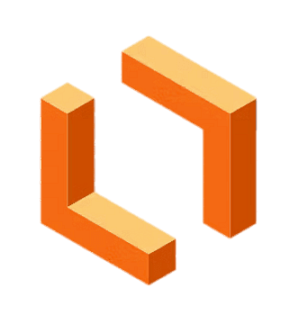
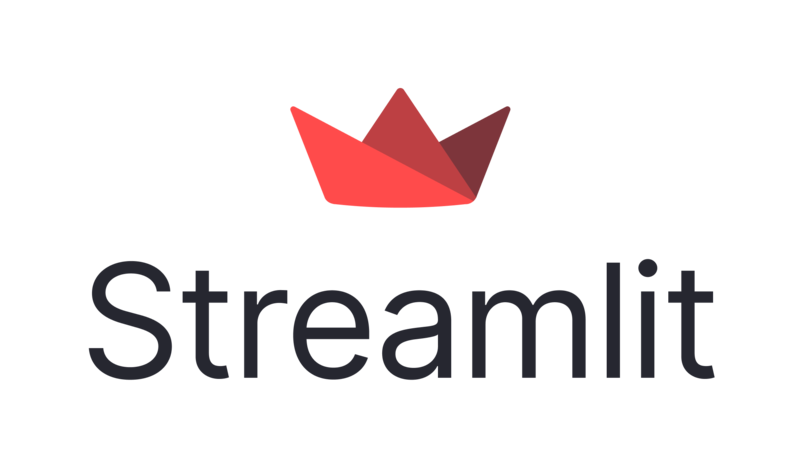

<h1 align="center">
  
</h1>

---

  
  

---

## 🌟 About Me

- 🧠 I'm an aspiring AI/ML Researcher with a strong foundation in machine learning algorithms.
- 👨‍💻 My passion for web development drives me to craft sleek, user-friendly interfaces while honing my expertise in full-stack technologies like JavaScript, Node.js, React.js, and Python.
- 🎨 Combining creativity and technical skills, I design intuitive digital experiences as a UI/UX Designer.
- ✍️ Writing engaging and impactful content is another avenue where I channel my creativity to connect with diverse audiences.
- 📘 As a computer engineering graduate, I thrive on the philosophy of continuous learning and growth.
- 🌍 Being trilingual, I embrace the challenge of learning a fourth language to broaden my horizons further.

---

## 🛠️ Skills & Expertise

### **Web Development**

  &nbsp;&nbsp;&nbsp;
  &nbsp;&nbsp;&nbsp;
  &nbsp;&nbsp;&nbsp;
  &nbsp;&nbsp;&nbsp;
  

### **Research & Development**

  
  
  
  

### **Others**

  
  

---

## 💻 Tech Expertise 

### **Programming Languages**

  &nbsp;&nbsp;&nbsp;
  &nbsp;&nbsp;&nbsp;
  &nbsp;&nbsp;&nbsp;
  &nbsp;&nbsp;&nbsp;
  &nbsp;&nbsp;&nbsp;

### **Design & Development Tools**

  &nbsp;&nbsp;&nbsp;
  &nbsp;&nbsp;&nbsp;
  &nbsp;&nbsp;&nbsp;
  &nbsp;&nbsp;&nbsp;
  
  &nbsp;&nbsp;&nbsp;
  &nbsp;&nbsp;&nbsp;
  &nbsp;&nbsp;&nbsp;
  &nbsp;&nbsp;&nbsp;
  &nbsp;&nbsp;&nbsp;

### **Productivity Tools**

  &nbsp;&nbsp;&nbsp;
  &nbsp;&nbsp;&nbsp;
  &nbsp;&nbsp;&nbsp;
  &nbsp;&nbsp;&nbsp;
  

---

## 📈 GitHub Stats  

---

## 🌱 My Current Projects  
1. **EcoSphereAI**: AI Driven Energy Optimization for Public Sector Networks.
2. **BestHealth**: AI powered mental health & wellness app.

---

## 🌐 Connect With Me  

  
  
  
  

---

## 🏆 Achievements  
- 🏅 **500+ problems solved** on **LeetCode** and **HackerRank** combined.
- - 🏆 **Badges Earned**:  
  - **HackerRank**:    
- 📝 Successfully delivered **50+ freelance projects** as a **Web Developer**, **Content Writer** and **UI/UX Designer**.

---

## 🔥 Fun Facts  
- 🗣️ I can speak fluently in English, Bangla, Hindi and currently learning Korean.
- 🧩 I can solve a Rubik's Cube in 2 minutes.
- ✈️ My dream vacation places are Oslo, Norway and Bali, Indonesia.
- 🐾 I have a cat and spending time with her is one of my favorite activity!  

---

## 📨 Get in Touch  
- 📧 Email: hasanulmukit.se@gmail.com  

---

⭐️ **Star this repo** if you like it! 😊
